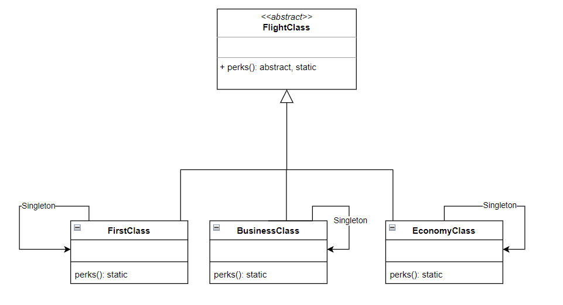

# Task 1: Flight Classes
Consider the following class diagram:


* The `FlightClass` class is the mother class. `FirstClass`, `BusinessClass` and `EconomyClass` are its children classes.
  

* The method `perks()` is a static method for each child class. In each case it returns a string showing the perks of each flying class. Example:
```Python Console
>>> print(FirstClass().perks())
First Class:
	Perks:
		Extra Leg Room
		Comfortable Seats
		Free Beverages
```
**Note:**: You are given the freedom to define the string of the perks in the way you like for each class.


* In the file [`src/task_1_flight_class`](src/task_1_flight_classes.py) define the class shown in the diagram above so that:
    - [ ] The inheritance pattern is respected.
    - [ ] The class `FlightClass` is abstract and inherits from the class `abc.ABC`.
    - [ ] The subclasses are singletons.
    - [ ] The method `perks` is static in each class and returns a string similar to the one described above.
