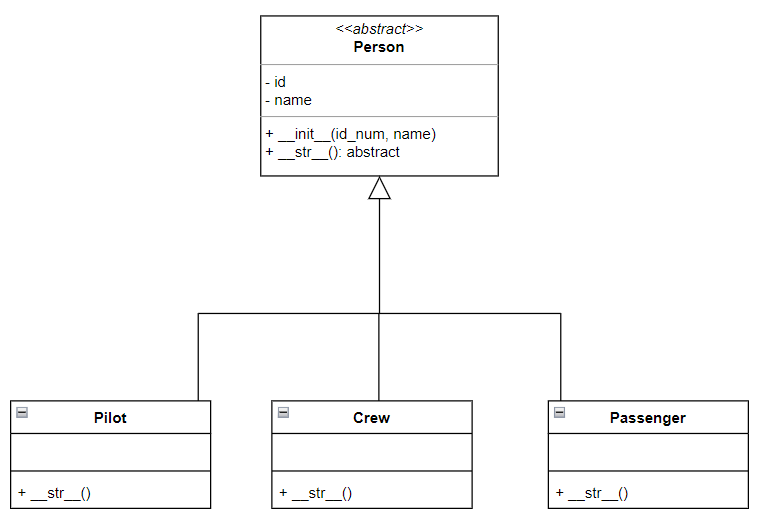

# Task 2: People to Board the Plane
Consider the following class diagram:


* The `Person` class is the mother class. `Pilot`, `Crew` and `Passenger` are its children classes.
  

* The method `__str__()` is an abstract method. For each child class, it returns a string showing the name, id and the type of the person in the airplane. Example:
```Python Console
>>> print(Pilot("X01", "Amir"))
Amir (X01) is the pilot.
```
**Note:**: You are given the freedom to define the string representation of each sub-class.


* In the file [`src/task_2_passenger`](src/task_1_passenger.py) define the class shown in the diagram above so that:
    - [ ] The inheritance pattern is respected.
    - [ ] The class `Person` is abstract and inherits from the class `abc.ABC`.
    - [ ] The method `__str__()` returns a string similar to the one described above.
